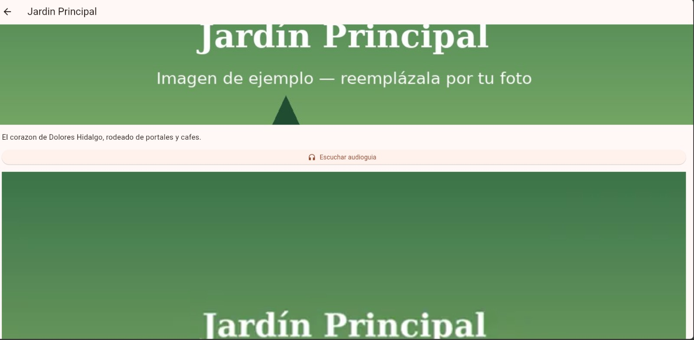
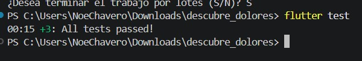

# Descubre Dolores Hidalgo

Guía turística multimedia (imagen, audio-guía y video) construida en Flutter con **Clean Architecture**.
Proyecto de la asignatura *Desarrollo Móvil Integral*.

## Arquitectura

```
Presentación  →  Dominio  ←  Datos
```

La regla de dependencia siempre apunta hacia adentro: el Dominio no conoce Flutter ni a las otras capas.

```
lib/
  domain/                      # Dart puro: entidades, contratos y casos de uso
    entities/lugar_turistico.dart
    repositories/lugares_repository.dart     (interfaz abstracta)
    usecases/obtener_lugares.dart
    usecases/obtener_lugar_por_id.dart
  data/                        # Implementaciones concretas
    datasources/lugares_local_datasource.dart
    repositories/lugares_repository_impl.dart
  presentation/                # MVVM + widgets
    viewmodels/lugares_view_model.dart
    viewmodels/detalle_view_model.dart       (controla la audio-guía)
    views/lista_lugares_screen.dart
    views/detalle_lugar_screen.dart          (imagen + audio + video)
  main.dart                    # Composition root
assets/
  images/  audio/  video/
test/
  obtener_lugares_test.dart    # TDD del Dominio con un Fake
  widget_test.dart             # Pruebas de ObtenerLugarPorId con un Fake
```

| Capa | Contiene | Depende de |
|---|---|---|
| Dominio | Entidades, casos de uso, interfaces de repositorio | Nada |
| Datos | `LugaresRepositoryImpl`, `LugaresLocalDataSource` | Dominio |
| Presentación | ViewModels (`ChangeNotifier`) y pantallas | Dominio |

## Paquetes

- [`audioplayers`](https://pub.dev/packages/audioplayers): audio-guía
- [`video_player`](https://pub.dev/packages/video_player): video del lugar

## Cómo ejecutar

```bash
flutter create . --project-name descubre_dolores   # solo la primera vez: genera android/, ios/, web/
flutter pub get
flutter run
flutter test
```

## Capturas

| Lista | Detalle | Pruebas |
|---|---|---|
|  |  |  |

## Checklist de Arquitectura Limpia

- [x] Ningún archivo en `domain/` importa `package:flutter/material.dart`
- [x] Las entidades del Dominio no tienen `fromJson`/`toJson`
- [x] Cada caso de uso representa una sola acción del usuario
- [x] Los ViewModels reciben casos de uso por su constructor
- [x] `main.dart` es el único archivo que conoce las clases concretas de las 3 capas
- [x] Existe al menos una prueba del Dominio usando un Fake
- [x] Los controladores de audio/video se liberan con `dispose()`

## Notas

- La app solo usa archivos incluidos en `assets/`, por lo que no requiere permisos peligrosos.
- Los archivos multimedia incluidos son de ejemplo; se pueden reemplazar por fotos, narraciones y video reales con los mismos nombres.
